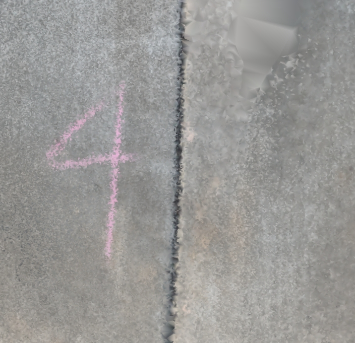
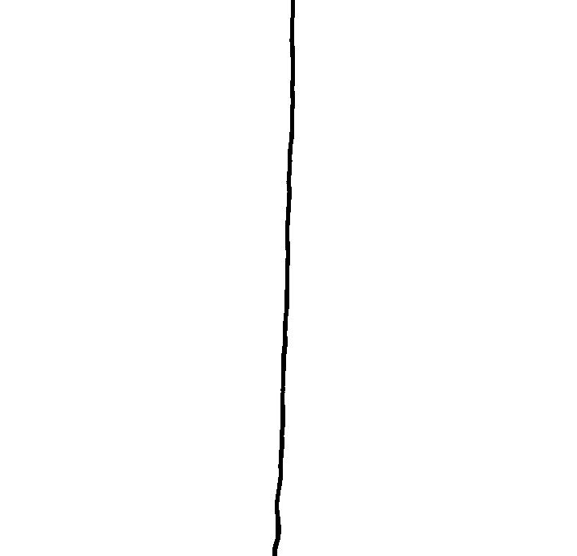
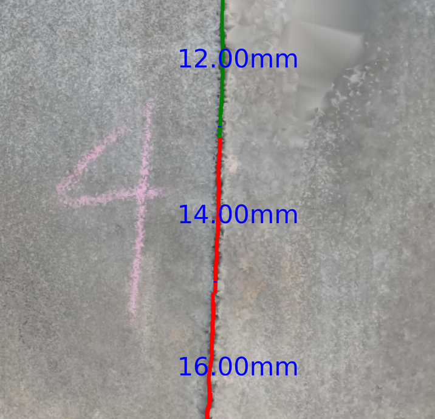
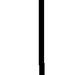
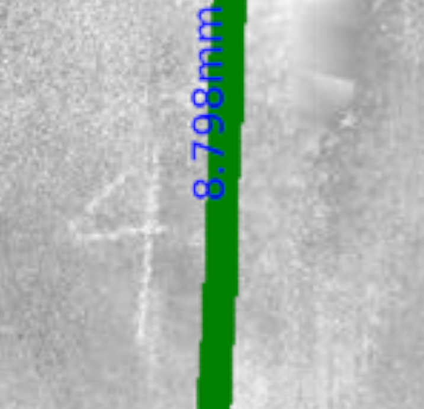

# boe-step-4-vertical-displacement

## Overview
This project provides tools for processing elevation and point cloud data, generating orthoimages, and segmenting vertical/horizontal membrane features using pre-trained U-Net models. It is designed for geospatial analysis and visualization tasks.

## Pre-trained Models
Download and place these pre-trained U-Net models in the project root:
- `vertical_unet_membrane.hdf5`
- `horizontal_unet_membrane.hdf5`
Download links:
- https://drive.google.com/file/d/1tp2Hv1UFGXyot_4ZvxVJNvTgZXEwe_kH/view?usp=sharing
- https://drive.google.com/file/d/1Kj1igyD03CkCGxvNQ84LfR0hhG_QqL5u/view?usp=sharing

## Requirements
Recommended versions for your virtual environment or Anaconda environment:
- Python 3.10
- Tensorflow 2.10
- Keras 2.10
- Numpy 1.26.4
- Matplotlib 3.8.4
- Pandas 2.1.4
- Pillow 11.2.1


The Pointcloud2Orthoimage.py has the following version requirements which should be installed alongside the previously mentioned versions:
- Laspy 2.5.4
- Open3d 0.17.0
- OpenCV 4.5.5
- Scipy 1.11.4

> **Note:** Newer versions of Tensorflow (e.g., 2.12) require Python 3.11 and newer OpenCV versions. Use at your own risk.

## Setup Instructions
If not using Anaconda:
1. Ensure Python 3.10 is installed.
2. Create a virtual environment:
	```bash
	python3.10 -m venv venv
	```
3. Activate the environment:
	- On Windows:
	  ```bash
	  .\venv\Scripts\activate
	  ```
	- On macOS/Linux:
	  ```bash
	  source venv/bin/activate
	  ```
4. Install dependencies:
	```bash
	pip install -r requirements.txt
	```
5. Download the model files and place them in the project root.


## Usage
Run the main script:
```bash
python src/main.py
```

### Script Descriptions
- `main.py`: Main entry point for the workflow.
- `elevation2csv.py`: Converts elevation data to CSV format.
- `pointcloud2orthoimage.py`: Converts point cloud data to orthoimages (requires additional dependencies).
- `reassemble_labeledRGB_images.py`: Reassembles labeled RGB images from tiles.
- `resize_dem_and_ortho.py`: Resizes DEM and orthoimage files.
- `segmentation2binarymask.py`: Converts segmentation results to binary masks.
- `unet.py`: Contains U-Net model architecture and utilities.
- `vertical_displacement.py`: Calculates vertical displacement from processed data.
- `visualize_results.py`: Visualizes results and outputs.

## Example Results
Below are example outputs for both horizontal and vertical displacement detection. The same region is shown for both, starting from the original RGB input, followed by the unet prediction and the labeled result overlay.

### Horizontal Displacement Detection
<p align="center">
	
	<br><em>Resized RGB Input</em>
</p>
<p align="center">
	
	<br><em>Horizontal Unet Prediction</em>
</p>
<p align="center">
	
	<br><em>Horizontal Labeled Result Overlay</em>
</p>

### Vertical Displacement Detection
<p align="center">
	
	<br><em>Resized RGB Input</em>
</p>
<p align="center">
	
	<br><em>Vertical Unet Prediction</em>
</p>
<p align="center">
	
	<br><em>Vertical Labeled Result Overlay</em>
</p>

## Contact
If you have any questions on the code or any of the process we used to create this tool, feel free to email me at [ElizabethRaborn02@gmail.com]!
